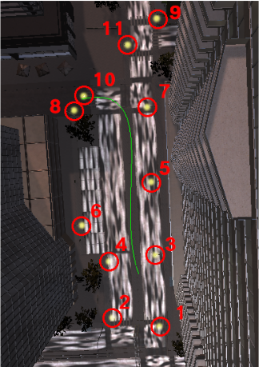
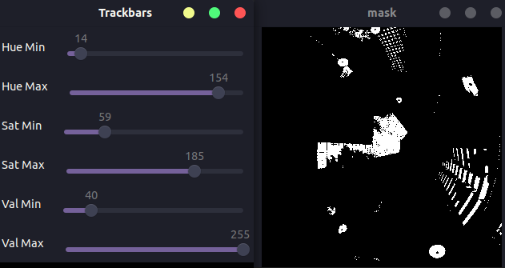
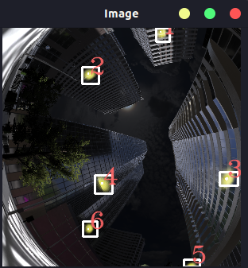
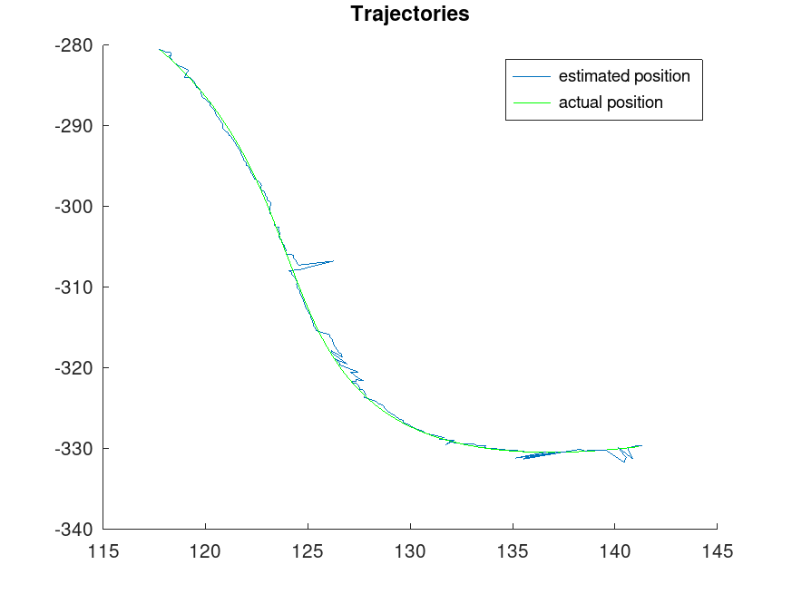

# Urban_Lights_Positioning_System
Study of the use of mapped urban lights for positioning system in hopes to solve urban canyon issues. Uses libraries such as Visp and openCV

## Positioning system

In estimePosePointsOmni directory :

- Premapped street lights (list of light coordinates)
 

- Light detection / image processing
 

- Pose estimation

- Results (use of the etudeTraj.m file)
 

Read the report for full explanation.

- Rapport_TX_Hadrien_Rothea -> Rapport

- Etude X -> dossier avec les graphiques des etudes des fichiers datax.txt

- ProjectionTesting -> programme avec les tests sur la projection

- etudeTraj.m -> script executable sur octave ou matlab
							-> copier/coller le contenue de datax.txt dans le tab = []
							-> puis executer le script pour voir les graphiques
							
 - XXXImage -> dossier d'image par thème
