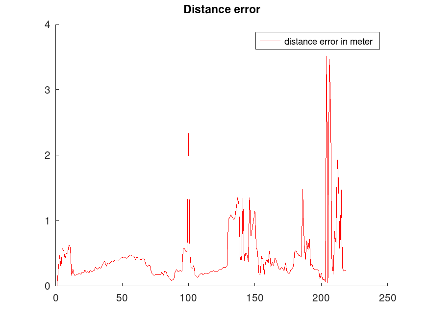

# Urban_Lights_Positioning_System
Study of the use of mapped urban lights and mounted omnidirectional camera for autonomous vehicule positioning system. Uses libraries such as Visp and openCV

## Positioning system

In estimePosePointsOmni directory :

- Premapped street lights (list of light coordinates)
 

- Light detection / image processing with omnidirectional camera
 

- Pose estimation

- Results (use of the etudeTraj.m file)
 
 

## Omidirectional camera simulation

In projectionTesting directory

 
 
 
 

